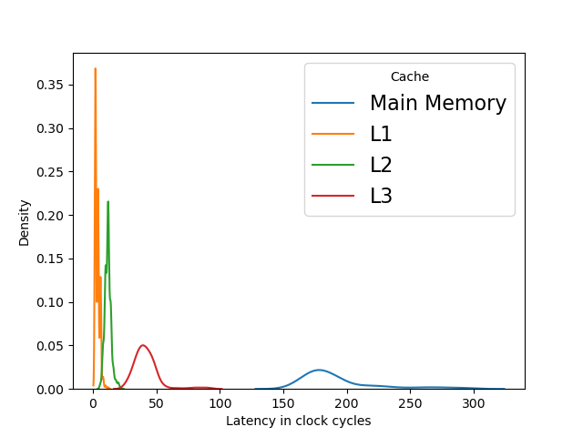

# Cache-Latency-Measure
This repository contains a C program to measure latency from all level of cache hierarchy.  
**NOTE:** All the details shown below are specific to [i7-9750H](https://en.wikichip.org/wiki/intel/core_i7/i7-9750h) processor.

## Contents
- [How To Use](#how-to-use)
- [Results](#results)
- [Working](#working)

## How To Use

## Results
The latency given on the [wikichip page](https://en.wikichip.org/wiki/intel/microarchitectures/coffee_lake#Memory_Hierarchy) for this processor model is:
```
L1 Data Cache: 4 cycles for fastest load-to-use, 5 cycles for complex addresses
L2 Cache: 12 cycles for fastest load-to-use
L3 Cache: 42 cycles for fastest load-to-use
Main Memory: 42 cycles + 51 ns latency
```
Here are the latency results obtained:  


## Working

## ToDo
- Add Documentation
